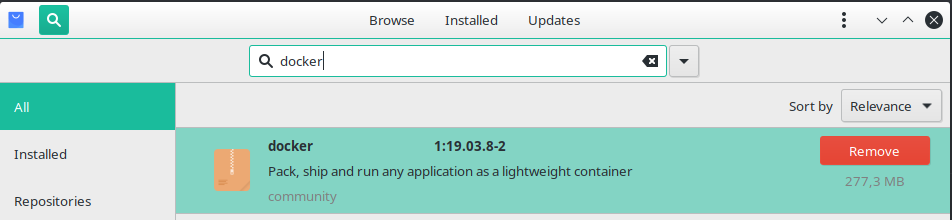
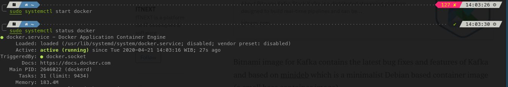
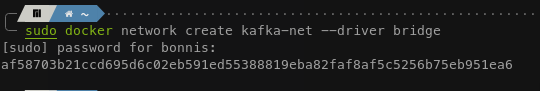
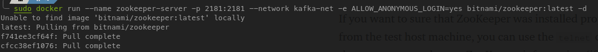
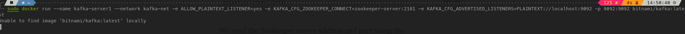

# Infrastuktur Kafka menggunakan Docker
## Instalasi Docker
Catatan : OS yang dipakai adalah distro linux, Manjaro  
1. Buka pamac software manager lalu cari docker, lalu install  

2. Buka console, mulai service docker dengan menggunakan  
```sudo systemctl start docker ```
3. Untuk mengecek statusnya maka jalankan perintah  
```sudo systemctl status docker ```  


## Instalasi Kafka
1. Buat network untuk docker cluster kita

2. Jalankan container ZooKeeper dari bitnami  
```docker run --name zookeeper-server -p 2181:2181 --network kafka-net -e ALLOW_ANONYMOUS_LOGIN=yes bitnami/zookeeper:latest```

3. Tes koneksi zookeeper dengan menjalankan  
```telnet localhost 2181```

4. Jalankan broker dengan menjalankan  
```docker run --name kafka-server1 --network kafka-net -e ALLOW_PLAINTEXT_LISTENER=yes -e KAFKA_CFG_ZOOKEEPER_CONNECT=zookeeper-server:2181 -e KAFKA_CFG_ADVERTISED_LISTENERS=PLAINTEXT://localhost:9092 -p 9092:9092 bitnami/kafka:latestt```  

5. Jalankan conduktor untuk mengetes kafka
6. Tambahkan broker